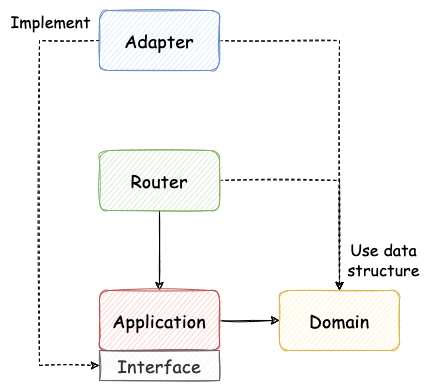

# Go-Clean-Arch

**Go-Clean-Arch** gives a Clean Architecture template that is commonly used in Crescendo's Go projects. We will introduce the proposed architecture and related designs through a tutorial on building a sample application - [Crescendo Barter](#crescendo-barter).

## Overview

The proposed clean architecture is inspired by DDD (Domain-Driven Design), Uncle Bob's [Clean Architecture](https://blog.cleancoder.com/uncle-bob/2012/08/13/the-clean-architecture.html), and a Go Clean Architecture project [Wild Workouts](https://github.com/ThreeDotsLabs/wild-workouts-go-ddd-example), trying to balance feature development speed and maintenance efforts.

## Features

Our proposed clean architecture tries to provide the following features:
- **Testable**. Critical logic is well protected and validated.
- **Ubiquitous language**. No communication barrier between business and engineering people.
- **First-class-citizen errors**. Handle errors throughout the application in handy.
- **Traceable requests**. Internal behaviors of a request could be observed through API and system logs.
- **Product-ready**. Teams could use the architecture template in their new projects directly.
- **Simple and straight**. Any new member could pick up the architecture within days.

## Architecture

The proposed architecture can be separated into 4 layers, including `Domain`, `Application`, `Router`, and `Adapter`.
- `Domain` handles domain models and critical business logic.
- `Application` handles use cases (orchestration of business rules), compositing functionalities of `Domain` and `Adapter`.
- `Router` handles input request things, such as HTTP request routing, authentication, access control, and parameter validation.
- `Adapter` handle output requests, such as accessing DB, communicate with other services, emit events.

Its dependency rules are:

More at [https://slides.com/jalex-chang/go-clean-arch-cresclab](https://slides.com/jalex-chang/go-clean-arch-cresclab).

## Crescendo Barter

Crescendo Barter is a second-hand goods exchange application in which people can post their old goods and exchange them with others.

### User Stories

Account management:
- As a client, I want to register a trader account.
- As a client, I want to log in to the application through the registered trader account.

Second-hand Goods:
- As a trader, I want to post my old goods to the application so that others can see what I have.
- As a trader, I want to see all my posted goods.
- As a trader, I want to see others’ posted goods.
- As a trader, I want to remove some of my goods from the application.

Goods Exchange:
- As a trader, I want to exchange my own goods with others.
    
### Project Dependencies

Main application

  
- [Golang](https://go.dev): ^1.17
- [gin](https://github.com/gin-gonic/gin): ~1.7.7
- [zerolog](https://github.com/rs/zerolog): ~1.26.1
- [sqlx](https://github.com/jmoiron/sqlx): ~1.3.4
- [PostgreSQL](https://www.postgresql.org/docs/13/index.html): ^13
  

Test usage

  
- [testify](https://github.com/stretchr/testify): ^1.8.0
- [mockgen](https://github.com/golang/mock): ~1.6.0
- [testfixtures](https://github.com/go-testfixtures/testfixtures): ^3.8.0
- [migrate](https://github.com/golang-migrate/migrate): ^4.15.0
- [dockertest](https://github.com/ory/dockertest): ^3.9.0

### Development Guideline

See [development guideline](./docs/development-guideline.md).
