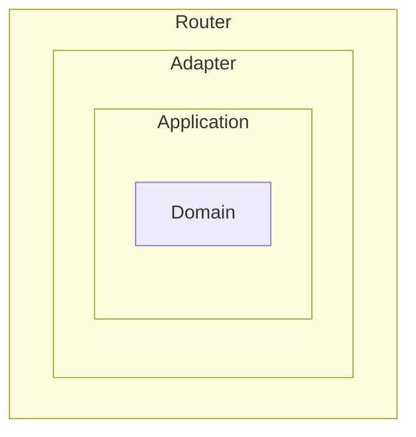
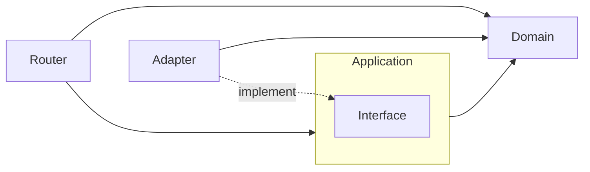

# Go-Clean-Architecture-Template

This repo introduces a Go clean architecture template commonly used in Crescendo Lab. We are going to explain how the architecture work through a tutorial on building a sample application - **Crescendo Barter**.

# Crescendo Barter

Crescendo Barter is a second-hand goods exchange application in which people can post their old goods and exchange them with others.

## 1. User Stories

- Account management
    - As a client, I want to register a trader account.
    - As a client, I want to log in to the application through the registered trader account.
- Second-hand Goods
    - As a trader, I want to post my old goods to the application so that others can see what I have.
    - As a trader, I want to see all my posted goods.
    - As a trader, I want to see others’ posted goods.
    - As a trader, I want to remove some of my goods from the application.
- Exchange proposals
    - As a trader, I want to apply an exchange proposal so that I can exchange my goods with others’.
    - As the application owner, I wanna every trader could apply at most 10 proposals at the same time so that they will not abuse the application.
    - As a trader, I want to see all proposals to me.
    - As a trader, I want to approve or disapprove  a proposal.
    - As a trader, I want to ownerships of goods are exchanged when a proposal is approved.

## 2. Codebase Architecture

The codebase architecture is inspired by concepts of DDD (Domain-Driven Design) and Clean Architecture and referencing [Wild Workouts](https://github.com/ThreeDotsLabs/wild-workouts-go-ddd-example), trying to make balance between feature development speed and maintenance efforts.

### 2.1. Codebase Layers
The codebase architecture can be separated into 4 layers, including `Router`, `Adapter`, `Application`, and `Domain`.
* `Router` handles input request things, such as HTTP request routing, authentication, access control, and parameter validation.
* `Adapter` handle output requests, such as accessing DB, communicate with external services, sending events to queues.
* `Application` handles orchestration of product features, compositing functionalities of `Domain` and `Adapter`.
* `Domain` handle core logic that is highly related to business and product features.



### 2.2 Dependency Rules



# Project Dependencies
* [Golang](https://go.dev): ^1.17
* [gin](https://github.com/gin-gonic/gin): ~1.7.7
* [zerolog](https://github.com/rs/zerolog): ~1.26.1
* [sqlx](https://github.com/jmoiron/sqlx): ~1.3.4
* [PostgreSQL](https://www.postgresql.org/docs/13/index.html): 13

# Development Guidelines

## 1. Unit Test

```shell
make test
```

## 2. Run Crescendo Barter on Local

### 2.1. Start Dependent Services

```shell
docker compose up -d
```

### 2.2. Init Local DB

```shell
make migrate-db-up
make init-local-db
```

### 2.3. Setup Application Configs

Some application configs have already configured in `Makefile` for running Crescendo Barter on local successfully.
These pre-configured configs provide basic functions, such as accessing DB.

For testing advanced features, we need assign related configs by ourselves, and the application configs can be assigned through:

1. Environment Variables
```shell
ENV=staging ./bin/applicatopn 
```

2. Command-Line Flags
```shell
./bin/applicatopn --env="staging"
```

Here lists the configurable application configs:
<details>
<summary> Common configs </summary>

| Env Var / Flag Var              | Description                                                             | Type    | Required | Default |
|---------------------------------|-------------------------------------------------------------------------|---------|----------|---------|
| `CB_ENV` <br> `env`             | The running environment.                                                | string  |          | staging |
| `CB_LOG_LEVEL` <br> `log_level` | Log filtering level.<br>Support error, warn, info, debug, and disabled. | string  |          | info    |
| `CB_PORT` <br> `port`           | The HTTP server port.                                                   | integer |          | 9000    |

</details>

<details>
<summary> Data systems </summary>

| Env Var / Flag Var                    | Description                                                 | Type    | Required | Default |
|---------------------------------------|-------------------------------------------------------------|---------|----------|---------|
| `CB_DATABASE_DSN` <br> `database_dsn` | The used Postgres DSN.                                      | string  | v        |         |                                            | string  |          |         |

</details>

<details>
<summary> Application Features </summary>

| Env Var / Flag Var                                                | Description                                               | Type    | Required | Default           |
|-------------------------------------------------------------------|-----------------------------------------------------------|---------|----------|-------------------|
| `CB_TOKEN_SIGNING_KEY` <br> `token_signing_key`                   | JWT Token signing key.                                    | string  |          | cb-signing-key    |
| `CB_TOKEN_ISSUER` <br> `token_issuer`                             | JWT Token issuer.                                         | string  |          | crescendo-barter  |
| `CB_TOKEN_EXPIRY_DURATION_HOUR` <br> `token_expiry_duration_hour` | JWT Token expiry hours used for customer-facing APIs.     | integer |          | 8 (8h)            |

</details>

### 2.4. Start Cantata on Local

```shell
make run
```

## 3. Migrate DB Schema

1. Add migration script in `migrations/`
    * `{no.}_{description}.up.sql`: migration script
    * `{no.}_{description}.down.sql`: rollback script
2. Run `make migrate-db-up`
3. If the migration result is unexpected, run `make migrate-db-down`

