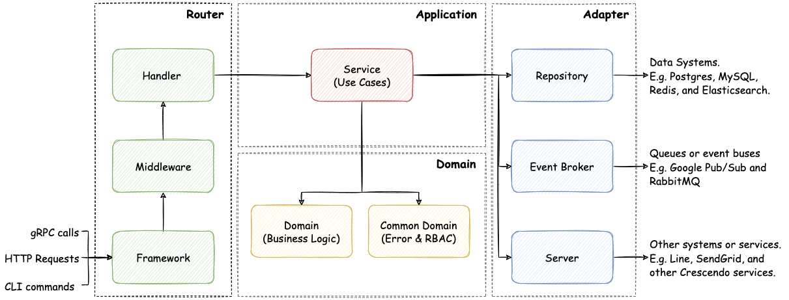

# Go-Clean-Arch

**Go-Clean-Arch** gives a DDD-lite clean architecture template that is commonly used in Crescendo's Go projects. We will introduce the proposed architecture and related designs through a tutorial on building a sample application - **Crescendo Barter**.

## Overview

The proposed clean architecture is inspired by DDD (Domain-Driven Design), Uncle Bob's [Clean Architecture](https://blog.cleancoder.com/uncle-bob/2012/08/13/the-clean-architecture.html), and a Go Clean Architecture project [Wild Workouts](https://github.com/ThreeDotsLabs/wild-workouts-go-ddd-example), trying to balance feature development speed and maintenance efforts.

Its eye-catching features include:
- **Layered architecture**: independent of frameworks and external systems.
- **Testable codebase**: workflows and business logic are well protected.
- **Ubiquitous language**: no barrier between business and engineering people.
- **Structured logs**: integrate third-party logging services easily.
- **First-class-citizen errors**: handle errors throughout the application in handy.
- **Product-ready code quality**: we implemented the sample application seriously.
- **Simple and straight**: new members could pick up the architecture within days.

## Architecture

The proposed architecture can be separated into 4 layers, including `Router`, `Adapter`, `Application`, and `Domain`.
* `Router` handles input request things, such as HTTP request routing, authentication, access control, and parameter validation.
* `Adapter` handle output requests, such as accessing DB, communicate with other services, emit events.
* `Application` handles use cases (orchestration of business rules), compositing functionalities of `Domain` and `Adapter`.
* `Domain` handle business logic and domain models.

### Dependency Rules

## Crescendo Barter

Crescendo Barter is a second-hand goods exchange application in which people can post their old goods and exchange them with others.

### 1. User Stories

- Account management
    - As a client, I want to register a trader account.
    - As a client, I want to log in to the application through the registered trader account.
- Second-hand Goods
    - As a trader, I want to post my old goods to the application so that others can see what I have.
    - As a trader, I want to see all my posted goods.
    - As a trader, I want to see others’ posted goods.
    - As a trader, I want to remove some of my goods from the application.
- Goods Exchange
    - As a trader, I want to exchange my own goods with others.
    
### 2. Project Dependencies

* [Golang](https://go.dev): ^1.17
* [gin](https://github.com/gin-gonic/gin): ~1.7.7
* [zerolog](https://github.com/rs/zerolog): ~1.26.1
* [sqlx](https://github.com/jmoiron/sqlx): ~1.3.4
* [PostgreSQL](https://www.postgresql.org/docs/13/index.html): 13

### 3. Development Guideline

See [development guideline](./docs/development-guideline.md).
